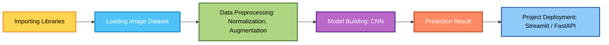

  

A **Deep Learning–based application** that classifies different types of rice grains from uploaded images.  
Built with **Python**, **TensorFlow/Keras**, and **Streamlit** for an interactive web interface.  

---

## 🔗 Live Demo  

👉 Visit <strong>Rice Grain Classifier Web App</strong>

  

---

## ✨ Key Features  

- 📤 **Upload & Predict** – Upload a rice grain image and get instant predictions  
- 🔎 **Top-K Results** – Displays most probable varieties with confidence scores  
- 🌾 **Supported Varieties**:  
  - Arborio  
  - Basmati  
  - Ipsala  
  - Jasmine  
  - Karacadag  
- 💻 **Clean Web UI** – Simple and interactive Streamlit interface  
- ⚡ **Real-Time Predictions** – Powered by a custom-trained CNN  

---

## 📊 Dataset  

- Custom-labeled dataset of different rice varieties (Arborio, Basmati, Ipsala, Jasmine, Karacadag)  
- Preprocessing: **resize, normalize, data augmentation**  
- Model trained on **balanced rice image dataset**  

---

## 🛠️ Tech Stack  

| Technology            | Purpose                          |
|-----------------------|----------------------------------|
| **Python 3.8+**       | Core Programming                 |
| **TensorFlow / Keras**| Deep Learning (CNN Model)        |
| **Streamlit**         | Web App Interface                |
| **FastAPI** *(optional)* | REST API Backend             |
| **OpenCV & PIL**      | Image Preprocessing              |
| **NumPy / Pandas**    | Data Handling                    |
| **Matplotlib / Seaborn** | Training Visualizations       |

---

## 🔮 How It Works  

1️⃣ **Upload** a rice grain image (JPG/PNG)  
2️⃣ Image is **preprocessed** (resize → normalize)  
3️⃣ **CNN model** predicts probabilities of each variety  
4️⃣ App shows **Top-K predictions with confidence scores**  

---

## 🖼️ Web Interface Screenshots  

### 🌾 Home Page (Uploading Image) 
  

### 🔍  Resizing the uploaded image 
  

### 📊 Prediction with Confidence Score
  

---

## 🚀 Future Enhancements  

- ➕ Add more rice varieties and expand dataset  
- 📱 Mobile-friendly responsive UI  
- ☁️ Deploy on **Hugging Face Spaces**, **AWS**, or **GCP**  
- 🧩 Enable **batch prediction** for multiple grains  

---

## 🤝 Contributing  

Contributions are welcome!  

1. 🍴 Fork the repository  
2. 🌱 Create a feature branch  
3. 🚀 Submit a pull request  

---

## 📌 Project Workflow  

## 👨‍💻 Author  

**Lomada Siva Gangi Reddy**  
- 🎓 B.Tech CSE (Data Science), RGMCET (2021–2025)  
- 💡 Interests: Python | Machine Learning | Deep Learning | Data Science  
- 📍 Open to **Internships & Job Offers**

 **Contact Me**:  

- 📧 **Email**: lomadasivagangireddy3@gmail.com  
- 📞 **Phone**: 9346493592  
- 💼 [LinkedIn](https://www.linkedin.com/in/lomada-siva-gangi-reddy-a64197280/)  🌐 [GitHub](https://github.com/shivareddy2002)  🚀 [Portfolio](https://lsgr-portfolio-pulse.lovable.app/)

---

  

